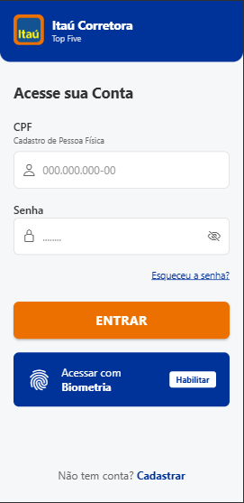
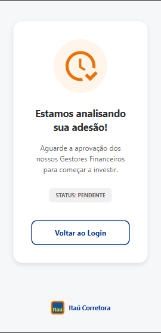
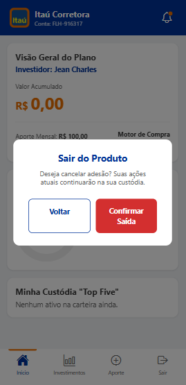

<div align="center">
  
  <h1>Index5 - Frontend Mobile (Área do Cliente) </h1>
  <p>Aplicativo móvel para clientes gerenciarem seus investimentos e acompanharem a carteira Index5.</p>
</div>

> 💻 **Nota sobre a Administração:** Este repositório foca exclusivamente no **Aplicativo Mobile** destinado ao cliente final. O fluxo de Backoffice e aprovações cadastrais feitas pelos funcionários está implementado na nossa **Aplicação Web**. Para acessar o projeto Administrativo, dirija-se ao repositório: [Index5-Web (GitHub)](https://github.com/jeancharlesexe/index5-fe).

---

<br/>

## 📖 Sobre o Projeto Mobile

O **Index5-MB** é o aplicativo móvel desenvolvido para que os clientes interajam de forma simples e intuitiva com a plataforma de investimentos Index5. Com uma navegação fluida em única tela reativa (Screen State Management), o App guia o usuário em todas as etapas de sua jornada financeira:

- **🔐 Registro e Login:** Criação de conta limpa utilizando apenas o CPF e garantindo a segurança de acesso do investidor.
- **📄 Adesão ao Fundo:** Fluxo de *Onboarding* onde o novo cliente define o valor que deseja aportar mensalmente antes de sua conta ser analisada.
- **⏳ Estado de Pendência:** Telas amigáveis que bloqueiam o acesso até que o Backofficeaprove o cadastro do cliente via plataforma Web.
- **📈 Dashboard Completo:** Uma vez ativo, o cliente tem acesso ao extrato de rentabilidade, histórico de compras mensais (Tickers e Custódias), e edição do valor de seu aporte.
- **🛑 Pausa/Saída (Exit):** Fluxo para solicitar a liquidação da carteira e saída do fundo a qualquer momento.

> Desenvolvido com foco em **Acessibilidade**, **Performance Nativa**, e **Experiência do Usuário (UX)** de ponta.

<br/>

## 📸 Fluxograma das Telas do Cliente (Screenshots)

*Adicione os prints das telas do celular abaixo apontando os caminhos das imagens reias na pasta `images/`.*

| 🔒 Tela de Login / Cadastro | 📋 Fluxo de Adesão | ⏳ Aguardando Aprovação |
| :---: | :---: | :---: |
|  |  |  |
| *Acesso e novos cadastros via CPF.* | *Tela definindo valor do aporte.* | *Bloqueio até aprovação do Admin.* |

<br/>

| 📊 Dashboard de Investimentos | ⚙️ Menu de Configurações | 🛑 Tela de Saída (Resgate) |
| :---: | :---: | :---: |
|  |  |  |
| *Resumo da carteira e custódia.* | *Alteração do aporte mensal.* | *Liquidação da carteira e fuga.* |

## 🛠️ Stack Tecnológico Mobile

O aplicativo foi criado buscando extrair o máximo do desenvolvimento multiplataforma utilizando as bibliotecas mais recentes do ecossistema React:

- **[React Native (v0.81.5)](https://reactnative.dev/):** Frame principal mantendo a paridade do código para compilar UI nativa tanto para Android quanto para iOS.
- **[Expo (v54)](https://expo.dev/):** Ferramental wrapper que abstrai complexidades nativas e oferece um ambiente de testes incrivelmente veloz.
- **[React 19](https://react.dev/):** Nova versão de renderização subjacente.
- **[Expo Vector Icons](https://docs.expo.dev/guides/icons/):** Biblioteca integrada de ícones vetoriais.
- **[Fetch API]:** Utilizado de forma nativa para consumir a API C# do `.NET`.

---

## ⚙️ Instalação e Execução (Passo a Passo)

### 1. Pré-Requisitos
Você deve ter na sua máquina previamente:
- [Node.js](https://nodejs.org/) (Sugerida versão LTS >= 20.x)
- O aplicativo **Expo Go** instalado no seu Celular, ou então um Emulador Android/iOS configurado no PC.
- O [Index5.API Backend](https://github.com/jeancharlesexe/index5) estar instanciado na sua rede (Lembre-se: emuladores às vezes precisam do seu IP de rede local ao invés de `localhost`).

### 2. Rodando o Projeto Mobile Local

Pelo seu terminal, clone o ambiente e instale:

```bash
# Navegue até a pasta do Frontend Mobile
cd index5-mb

# Instale os módulos requeridos do Expo e Native
npm install

# Inicie o Servidor de Desenvolvimento do Expo
npm start
```

*(Ou você pode usar comandos específicos como `npm run android` para injetar direto no emulador).*

### 3. Acesso (QR Code)
O Expo irá subir um Metro Bundler e exibirá um gigante **QR Code** no seu terminal.
1. Abra a câmera do seu celular (iOS) ou o aplicativo *Expo Go* (Android).
2. Escaneie o código.
3. O aplicativo sofrerá um *build* *over-the-air* (OTA) e abrirá a nossa `Splash Screen` em segundos diretamente na palma da sua mão!

---

## 📡 Integração com Backend

A comunicação com as rotas que protegem o banco de transações acontece através da injeção do token JWT JWT salvo nativamente em memória e da requisição `fetch` sob a rota `/api/v1/clients/me` logo após o Login. 

Se o App identificar o status `PENDING`, ele abortará a abertura do `Dashboard` e prenderá o cliente na camada *PendingApproval*, assim como exigido pelas regras de segurança de novos aportes da B3.

<div align="center">
  <sub>Construído por Jean Charles ♥</sub>
</div>
